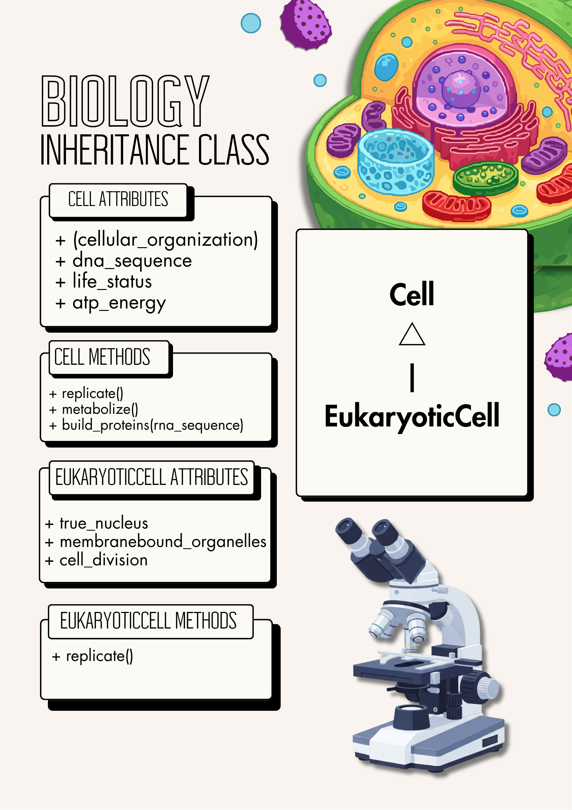
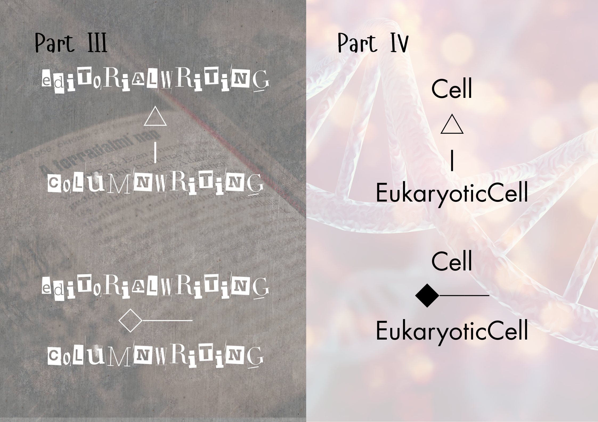
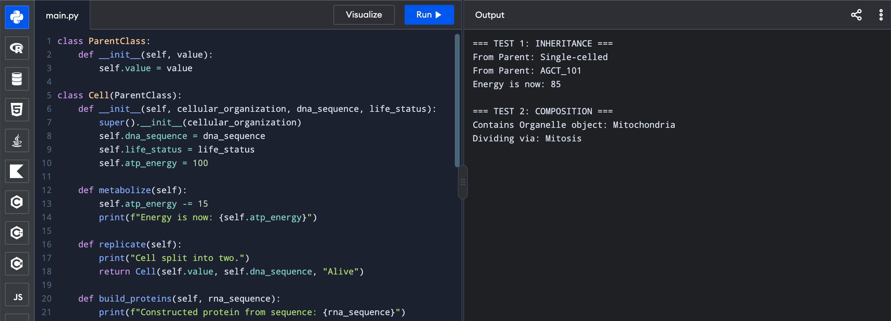
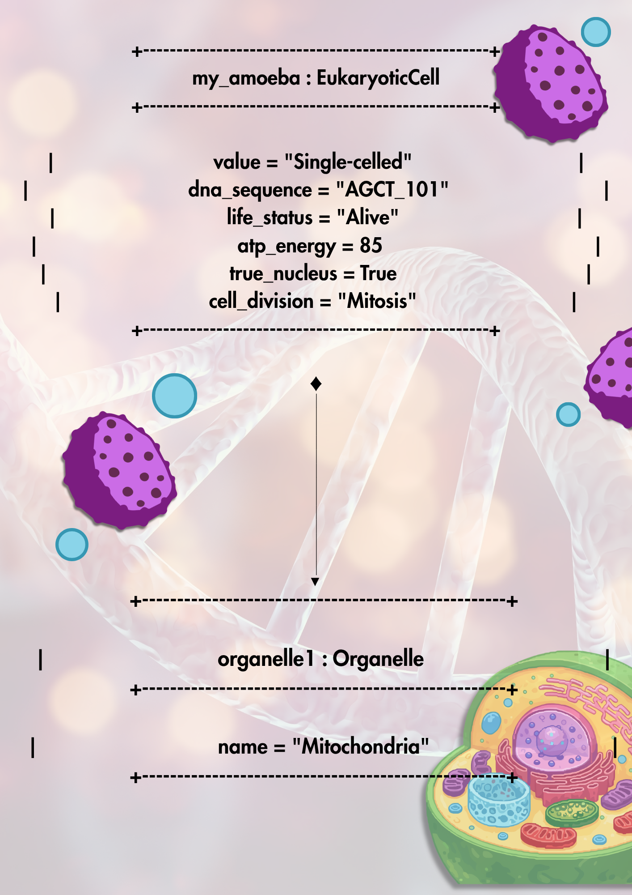

# Advanced Class Relationships

## Previous Activities

[classAttrib](classAttributesMethods.md)

[classRel](classRelationships.md)

## Existing System Description:

Class 1: EditorialWriting

Class 2: ColumnWriting

Problem/limitation: some repeated attributes, some repeated methods

## Inheritance Relationship

Parent: Cell

Child: Eukaryotic Cell

Explanation: A eukaryotic cell is a type of cell in biology.

## Inheritance UML

## Composition/Aggregation

Relationship: Composition

Explanation: Without any cells, eukaryotic cells can't exist either.

## Advanced UML Diagram

## Python Implementation

[Source Code](advancedRelationships.py)

## Test Run

## Object Diagram

## Reflection

### Why did you choose your inheritance relationship? Explain why your child class is a type of your parent class.

My child class is a type of my parent class because eukaryotic cells are a type of cell in biology.

### How did inheritance reduce duplicate code? Identify attributes or methods that were reused.

The replicate() method was reused in both the parent and child classes. Inheritance reduces duplicate code by passing down attributed and/or methods 

### Why is your HAS-A relationship Composition or Aggregation? Explain the lifecycle relationship between the two objects.

My HAS-A relationship is composition because when the parent class of cells somehow disappears, the child class of eukaryotic cells can't exist either because they are already a type of that class.

### What is the difference between Association from Part III and the advanced relationship you implemented?

In Part III, the association between my original classes was aggregation, where one class can still function without the other. Part IV, on the other hand, was associated with composition, where both classes and objects can't function when one class is removed.

### How does your design follow the DRY principle?

My design relies heavily on the OOP pillar of inheritance and the association of composition. It makes the child class inherit some of the attributes and methods of the parent class. This reduces code duplication, and makes programming more efficient. 

