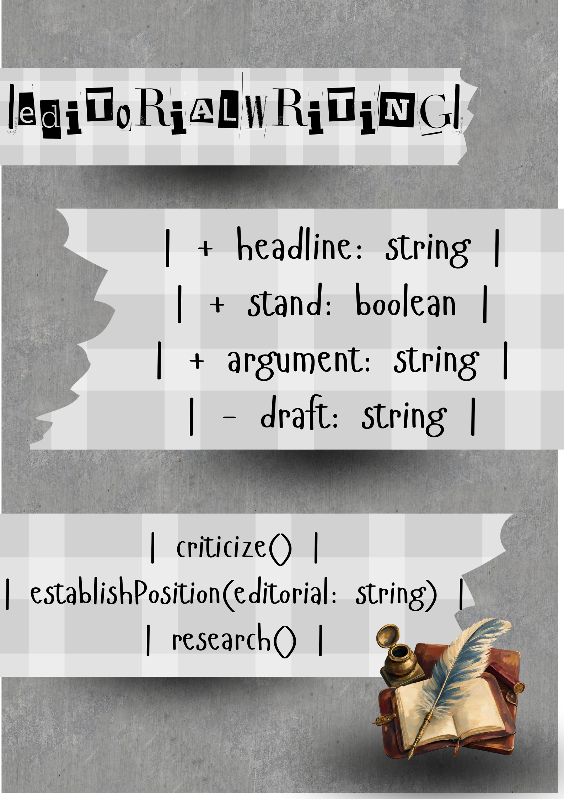
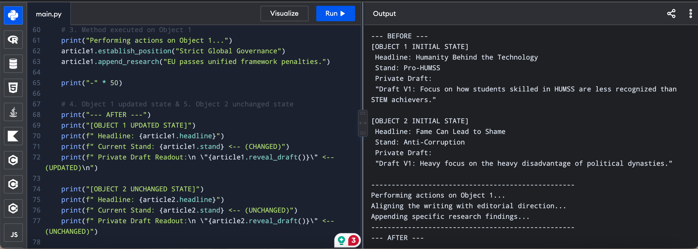
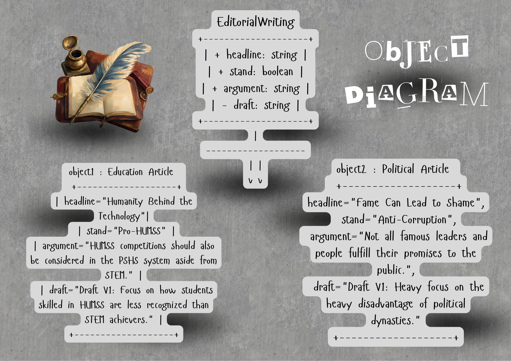

# Class Attributes and Methods

## Previous Design

Link to my previous activity:

[classObjectUML.md](q1/classObjectUML.md)

## Design Revision

Changes from my previous design:
- The attribute "counterargument" is now "draft".

## Visibility Decisions

| Attribute | Data Type | Visibility | Reason |
|---|---|---|---|
| headline | string | Public | The main title of the article must be modified and viewed freely by copywriters and editors. |
| stand | boolean | Public | The main opinion of the publication must be shared publicly as it defends the pub’s perspective. |
| argument | string | Public | The supporting pieces of the stand must be shared publicly for people to openly ponder, and for copywriters and editors to modify. |
| draft | string | Private | The draft must be protected internally as it consists of raw and unedited text that may contain inaccuracy in both grammar and facts. |

## Updated UML Class Diagram

## Python Implementation

[View Python Source](classImplementation.py)

## Test Run

## Object Diagram

## Analysis

### Why did you make your chosen attribute private?

I made my chosen attribute "draft" private because no one would want to see a messy, unrevised draft in public.

### Which method changes the state of your object?

### How did your two objects demonstrate that instances are independent?

### What is the difference between your class diagram and your object diagram?

