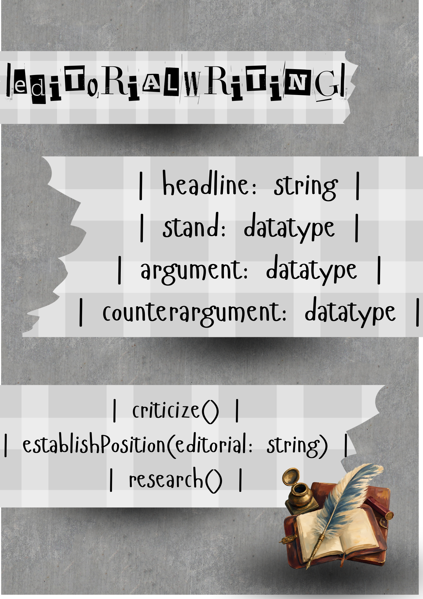

**Name:** Shanaye Brielle B. Sergio

**Section:** Platinum

**Last Name:** Sergio

**Date:** September 3, 2026

# SG4 - Understanding Classes and Objects

## Class Name
Context: Journalism
Class Name: EditorialWriting

## Class Description
A writing category for journalism. It is the voice of a publication.

## Properties

| Property | Data Type | Description |
|---|---|---|

| headline | string | Headline of the editorial |
| stand | boolean | If a publication agrees or disagrees with the editorial's topic |
| argument | string | A supporting piece of evidence for the thesis |
| counterargument | string | A piece of evidence that may oppose the argument |

## Methods

| Method | Description |
|---|---|| | |

| criticize() | |
| research()| |
| establishPosition(editorial:string) | |

## Class Diagram

## Design Explanation

### Why did you choose this class?
I chose this class because I have a passion for journalism, specifically editorial writing or any other category that involves opinion writing.

### Which property is the most important? Why?
The "stand" is the most important property because it controls the flow of the entire editorial.

### Which method is the most useful? Why?
research() is the most useful because it will help broaden your knowledge and perspective on the editorial's topic and help you establish a stand. 
