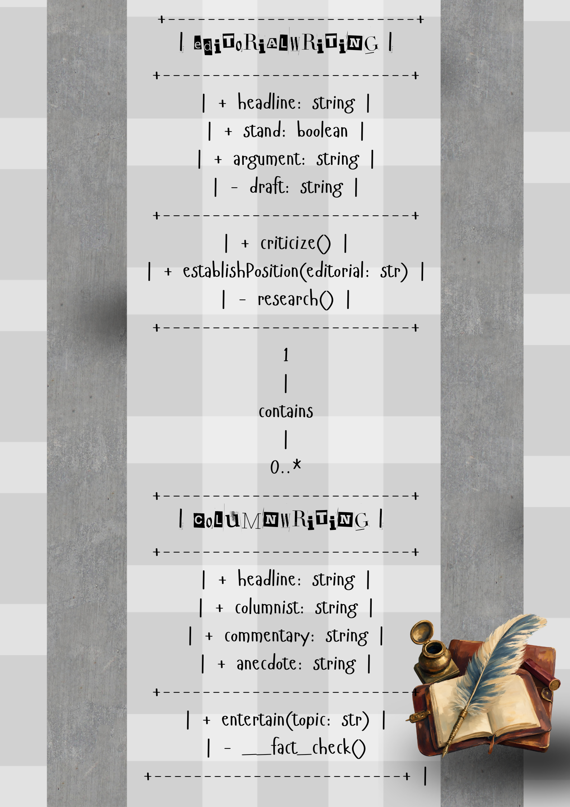
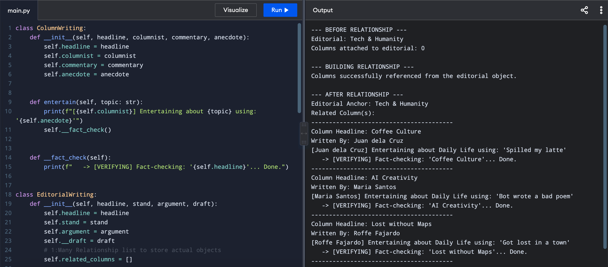
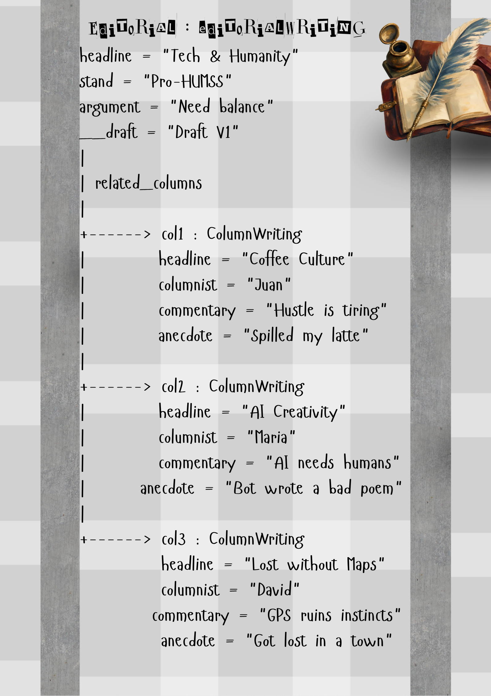

# Class Relationships: Association and Multiplicity

## Previous Work

[Part I - Classes and Objects](classObjectUML.md)

[Part II - Class Attributes and Methods](classAttributesMethods.md)

## Existing Class

Class: EditorialWriting

Description: A writing category for journalism. It is the voice of a publication.

## New Related Class

Class: ColumnWriting

Description: Another writing category for journalism. It shows the opinions and personal experiences of the columnist. 

## Association

Relationship: EditorialWriting contains references for ColumnWriting. 

Explanation: 

## Multiplicity

Multiplicity: One-to-Many

Explanation: One editorial can serve as a reference for many columns and opinion articles. 

## UML Class Relationship Diagram

## Python Implementation

[View Python Source](classRelationships.py)

## Test Run

## Object Relationship Diagram

## Analysis

### What is the association between your two classes?

The association between classes EditorialWriting and ColumnWriting is a specific type of has-a relationship called aggregation.

### What multiplicity did you choose and why?

I chose the "one-to-many" multiplicity because one editorial in a newspaper publication can influence or act as a reference for several columns within the opinion page.

### How did you implement the relationship in Python?

This was implemented through an empty list called self.related_columns = []. add_column(self, column_object) was then made to take the three ColumnWriting objects and append them into the list.

### Why did you store an object reference instead of copying its data?

Storing an object reference connects it for automatic memory. When the columnist(s) edit/s their article's commentary or anecdote, their progress and other changes are automatically saved. Copying data, on the other hand, is disconnected and all edits can be forgotten, leading to outdated info. 

### If your relationship uses many, why is a list appropriate?
A list is appropriate for the multiplicity one-to-many because it can store infinite object references. It preserves the sequence of columns. It also uses a for loop that can track the location of any object within the list. 